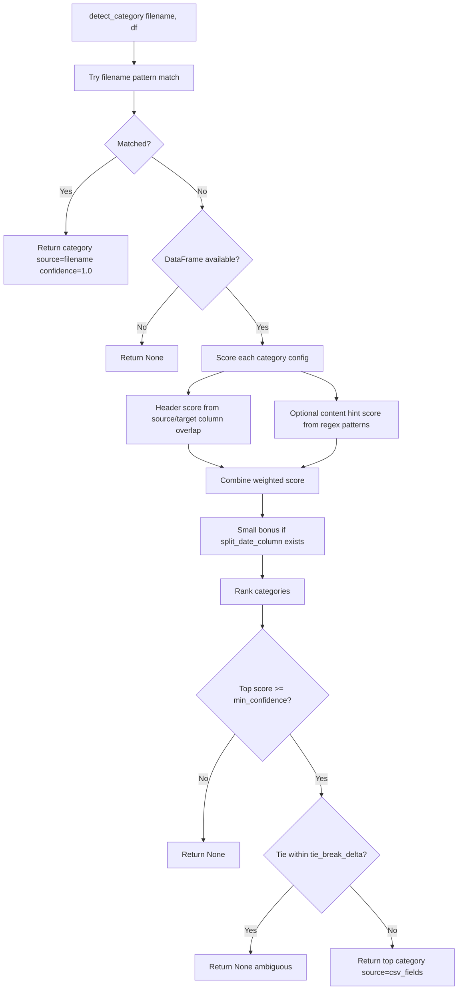
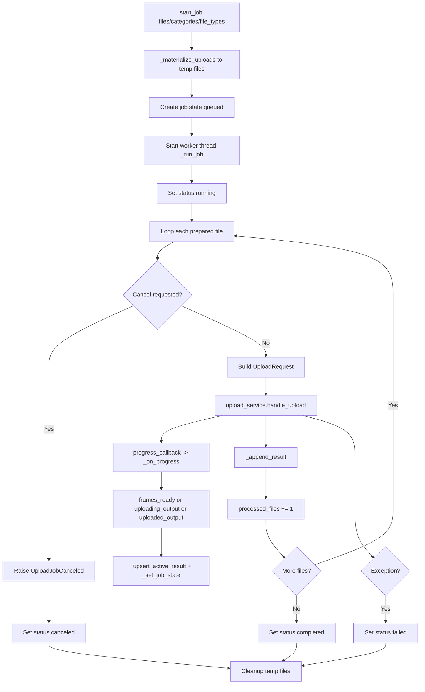
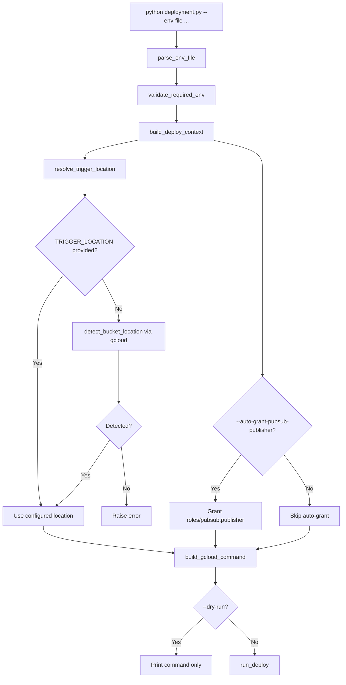
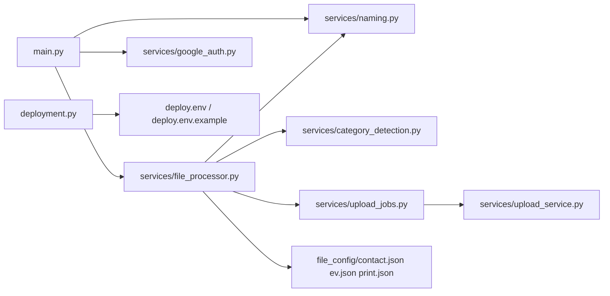

# Codebase Flowchart

This document visualizes the main execution paths in the project.

## 1) Runtime Data Pipeline (GCS Trigger -> Process -> Upload)

```mermaid
flowchart TD
    A[GCS Object Finalize Event] --> B[main.py: process_gcs_file]
    B --> C{Bucket matches SOURCE_BUCKET?}
    C -- No --> C1[Ignore event]
    C -- Yes --> D{Object is .csv?}
    D -- No --> D1[Ignore non-CSV]
    D -- Yes --> E[_get_processor]

    E --> F{Processor already cached?}
    F -- Yes --> G[Reuse FileProcessingService]
    F -- No --> H[_build_processor]

    H --> I[Read env vars]
    I --> J[build_google_auth_context]
    J --> K{Key file exists?}
    K -- Yes --> K1[Service account credentials]
    K -- No --> K2[ADC fallback]
    K1 --> L[create_storage_client]
    K2 --> L

    H --> M[load_processing_configs from file_config/*.json]
    H --> N[FilenameConventionService(default_naming_rules)]
    L --> O[Create FileProcessingService]
    M --> O
    N --> O
    O --> G

    G --> P[process_uploaded_object]
    P --> Q[_download_csv from source bucket]
    Q --> R{CSV empty?}
    R -- Yes --> R1[Raise error]
    R -- No --> S[CategoryDetectionService.detect_category]

    S --> T{Category detected?}
    T -- No --> T1[Raise error]
    T -- Yes --> U[_rename_columns using field_mapping]
    U --> V[_validate_patterns]
    V --> W{Validation score >= threshold?}
    W -- No --> W1[Raise error]
    W -- Yes --> X[_split_by_date using split_date_column]

    X --> Y{Any dated groups?}
    Y -- No --> Y1[Raise error]
    Y -- Yes --> Z[For each split date]

    Z --> AA[naming_service.build_filename]
    AA --> AB[_build_destination_path category/YYYY/MM/file]
    AB --> AC[upload_csv_content to target bucket]
    AC --> AD[Collect output metadata]
    AD --> AE[Return uploaded outputs]
```

## 2) Category Detection Logic



## 3) Upload Job Manager Path (Async file uploads)



## 4) Deployment Script Path



## 5) Key File Relationships


